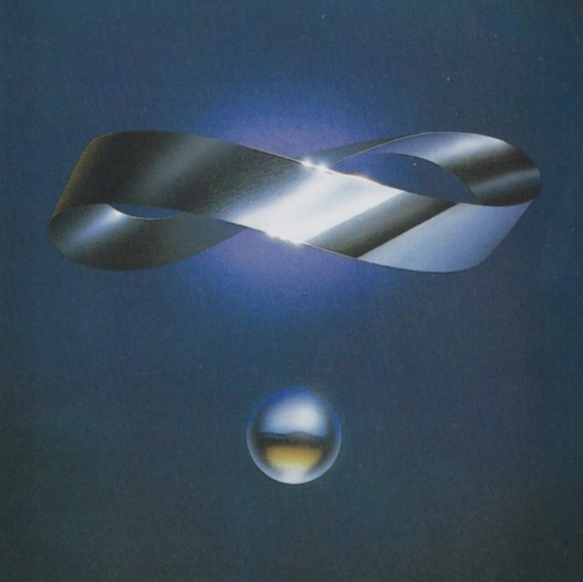

AI ethicist at heart. Data Engineer & ML-Ops by trade.

## About Me

> 🤖 Currently building an agentic RAG system to detect user affinity groups, online factions & LLM Bot activity by applying NLP & NLI paradigms to web intelligence.

- 📧 How to reach me: [Email](mailto:ja.harr91@gmail.com)
- 💼 Know about my experiences: [LinkedIn](https://www.linkedin.com/in/jordan-alexander-harris/)

## Connect with me:

## 🛠️ Languages-Frameworks-Tools 🛠️

  
   
  
   
  
   
  

## ⚡ Stats ⚡

  
  

  

  

  

---

  

